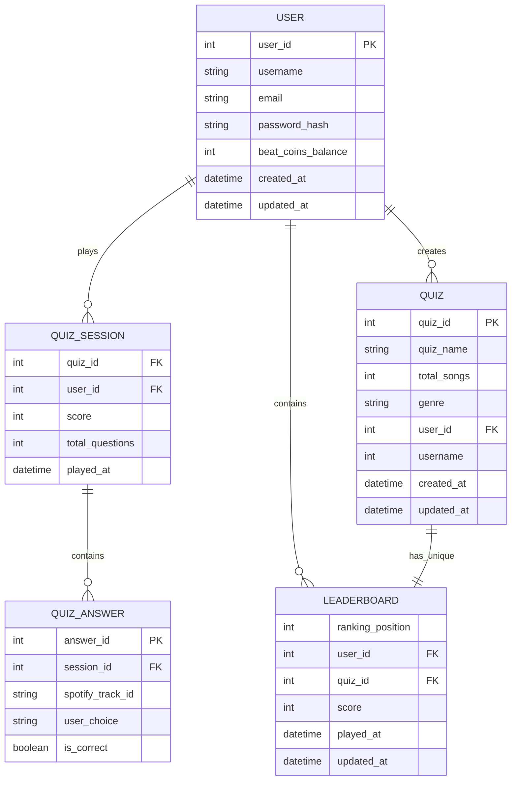

{: .no_toc }
# Data Model

Table of contents

+ ToC
{: toc }
{: .text-delta }

#### 1. Entities & Attributes
* **User:** Speichert die Account-Daten, sowie eine Authentifizierung (gehashte Passwörter)
* **Quiz_Session:** Protokolliert jedes gespielte Spiel eines Nutzers mit dem finalen Score, um Highscores für das Leaderboard zu berechnen
* **Quiz_Answer:** Speichert die Antwort zu jeder einzelnen Frage innerhalb einer Session
* **Quiz:** Speichert die von Creatoren erstellten Quiz-Pakete mit Bezug zu einem Genre
* **Leaderboard:** Speichert absteigend die User mit den höchsten Punktzahlen für ein bestimmtes Quiz

#### 2. Relations (Beziehungen)
* **User to Quiz_Session (1:N):** Ein User kann viele Quiz-Sessions spielen, aber eine Session gehört immer exakt zu einem User
* **Quiz_Session to Quiz_Answer (1:N):** Eine Quiz-Session besteht aus mehreren beantworteten Fragen
* **User to Quiz (1:N):** Ein User kann als "Creator" mehrere Quizze erstellen
* **Quiz to Leaderboard (1:1):** Pro Quiz gibt es genau ein Leaderboard
* **User to Leaderboard (1:N):** Ein User kann in mehreren Leaderboards gelistet sein
