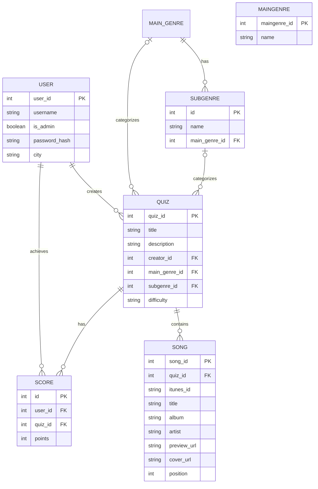

{: .no_toc }
# Data Model

Table of contents

+ ToC
{: toc }
{: .text-delta }

#### 1. Entities und Attribute
* **User:** Speichert die Account-Daten, sowie eine Authentifizierung (gehashte Passwörter)
* **Quiz:** Speichert die von Creatoren erstellten Quiz-Pakete mit Bezug zu einem Genre und dem Schwierigkeitslevel
* **Maingenre:** Enthält alle gängigen Oberkategorien als Liste um sie für die Quizbeschreibung zu nutzen
* **Subgenre:** Enthält spezifische Musikrichtungen als Unterkategorie des Maingenres
* **Score:** Speichert absteigend die User mit den höchsten Punktzahlen für ein bestimmtes Quiz
* **Song:** Der Song enthält alle Daten, die für die API mit Itunes notwendig sind, sowie die 30-Sekunden Vorschau und die Position der Songs im Quiz

#### 2. Relationen
* **User to Quiz (1:N):** Ein User kann als "Creator" mehrere Quizze erstellen. jedes Quiz gehört über `creator_id` immer genau einem User
* **Quiz to Score (1:N):** u jedem Quiz können viele Scores entstehen, jeder Score bezieht sich auf genau ein Quiz
* **Quiz to Song (1:N):** Ein Quiz enthält mehrere Songs, sortiert über das Feld `position`; jeder Song gehört zu genau einem Quiz
* **User to Score (1:N):** Ein User kann viele Scores erzielen, jeder Score gehört zu genau einem User
* **MainGenre to Subgenre (1:N):** Ein Hauptgenre kann mehrere Subgenres haben; jedes Subgenre gehört zu genau einem Hauptgenre
* **MainGenre to Quiz (1:N, optional):** Ein Quiz kann einem Hauptgenre zugeordnet sein
* **Subgenre to Quiz (1:N, optional):** Ein Quiz kann einem Subgenre zugeordnet sein

