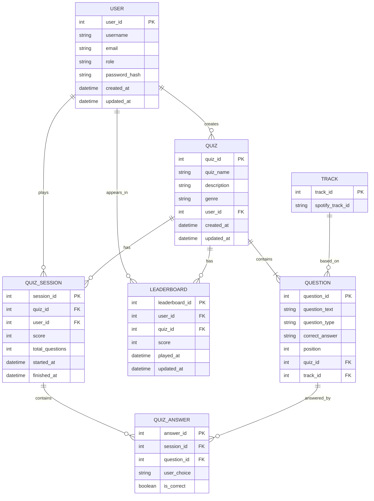

{: .no_toc }
# Data Model

Table of contents

+ ToC
{: toc }
{: .text-delta }

#### 1. Entities und Attribute
* **User:** Speichert die Account-Daten, sowie eine Authentifizierung (gehashte Passwörter)
* **Quiz_Session:** Protokolliert jedes gespielte Spiel eines Nutzers mit dem finalen Score, um Highscores für das Leaderboard zu berechnen
* **Quiz_Answer:** Speichert die Antwort zu jeder einzelnen Frage innerhalb einer Session
* **Quiz:** Speichert die von Creatoren erstellten Quiz-Pakete mit Bezug zu einem Genre
* **Leaderboard:** Speichert absteigend die User mit den höchsten Punktzahlen für ein bestimmtes Quiz
* **Question:** verknüpft einen Quiz-Eintrag mit einem Track. Das Feld question_type ermöglicht spätere Erweiterungen ohne Schemaänderung. position steuert die Reihenfolge der Fragen
* **Track:** Der Track speichert ausschließlich die spotify_track_id. Titel, Cover-Art und Audio-Preview werden zur Laufzeit live via Spotipy bezogen

#### 2. Relationen
* **User to Quiz_Session (1:N):** Ein User kann viele Quiz-Sessions spielen, aber eine Session gehört immer exakt zu einem User
* **Quiz_Session to Quiz_Answer (1:N):** Eine Quiz-Session besteht aus mehreren beantworteten Fragen
* **User to Quiz (1:N):** Ein User kann als "Creator" mehrere Quizze erstellen
* **Quiz to Leaderboard (1:N):** Pro Quiz kann es mehrere Einträge im Leaderboard geben
* **User to Leaderboard (1:N):** Ein User kann in mehreren Leaderboards gelistet sein
* **Track to Question (1:N):** Ein Track kann in mehreren Fragen vorkommen
* **Question to Quiz_answer (1:N):** Eine Question kann mehrere Quiz_answers enthalten
* **Quiz to Question (1:N):** Ein Quiz muss mindestens eine Question enthalten

